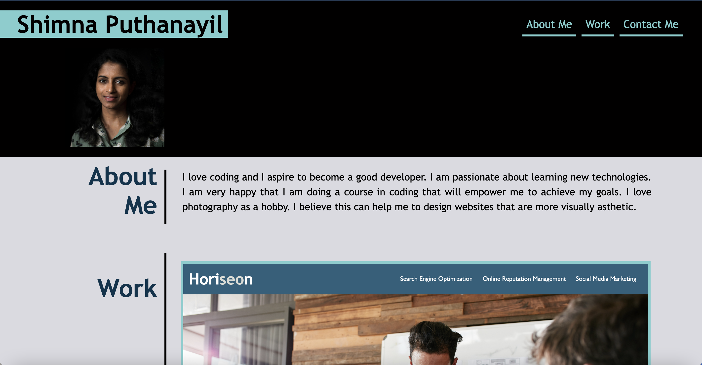
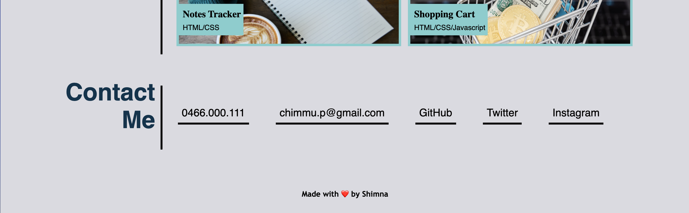
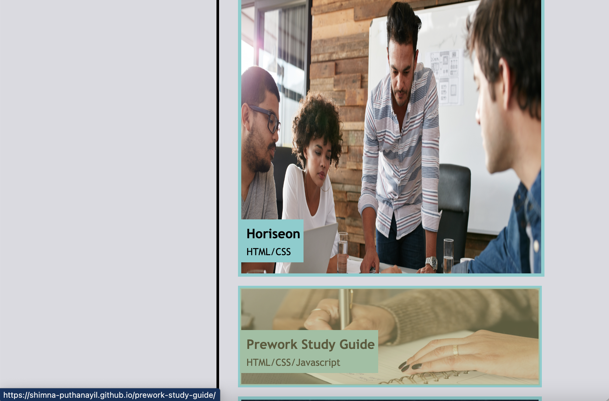
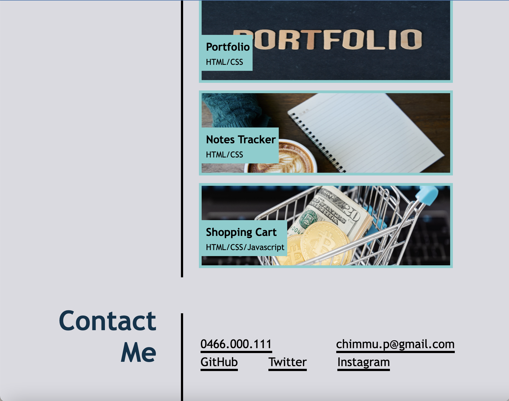
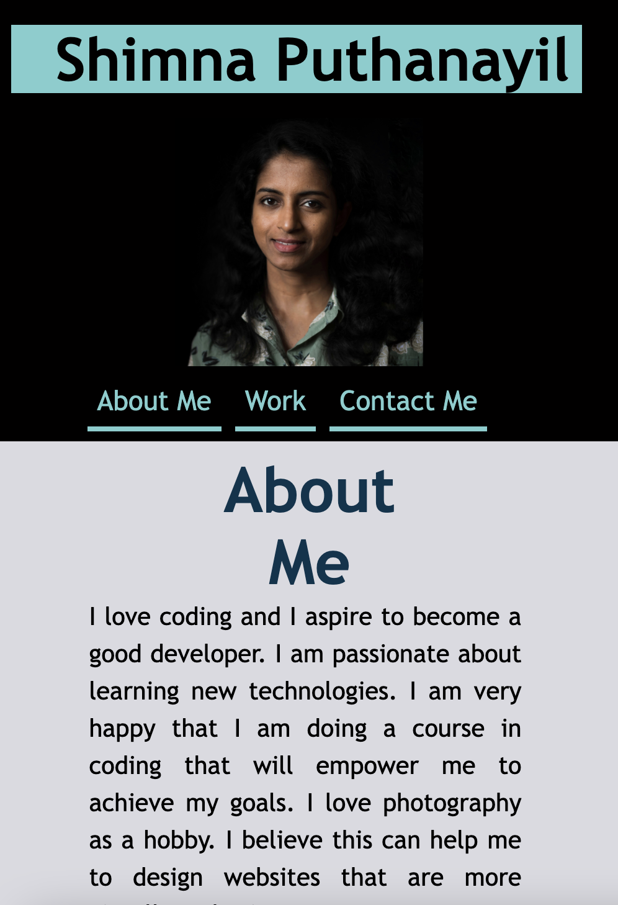
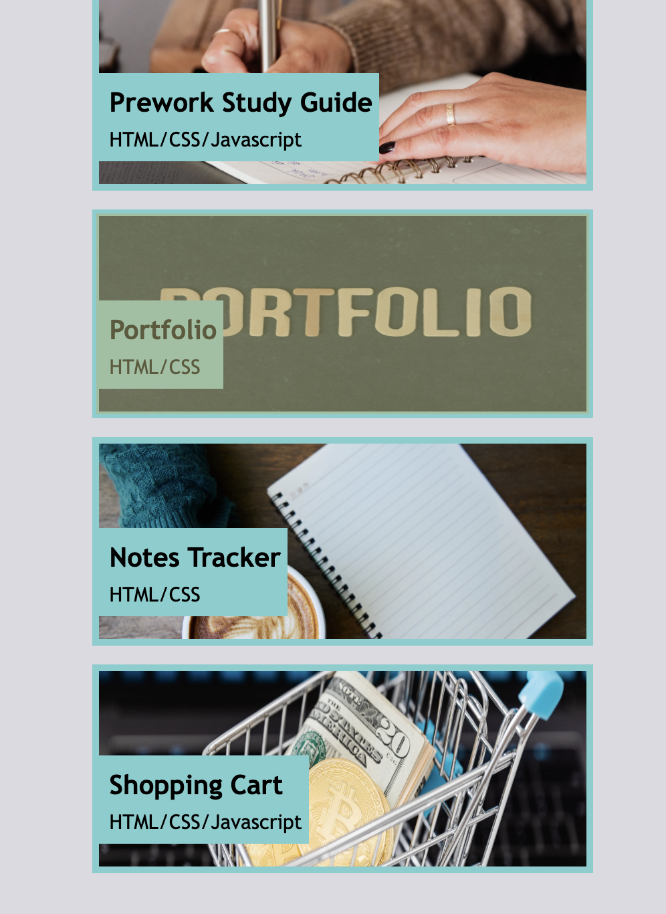
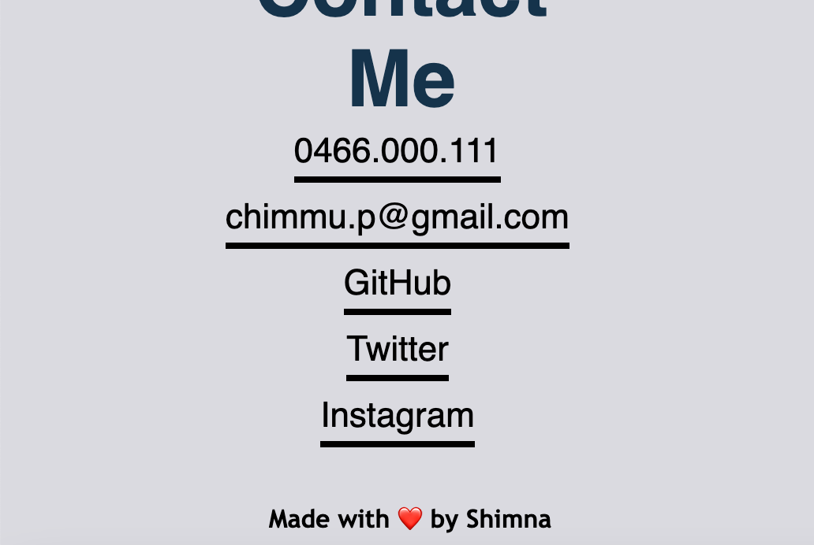

# Portfolio Responsive Webpage

## Description

This is a portfolio website which showcases my projects. The website contains about me section, work section and a contact details section.The layout of the work section is displayed in a way that the first application image is larger in size compared to others.The website is built with a responsive layout which makes it adaptable to different screen sizes.

## Installation

N/A

## Usage

There are mainly 3 sections in this website which can be accessed through the navigation links at the top.
The first section, About Me, contains a brief introduction. The second section Work, is made up of 5 important works by me. Each work is displayed as an image with title which when clicked navigates to the corresponding web page.Up on mouse hovering the image will be highlighted. Lastly, Contact Me, includes the contact details- mobile number, email id, GitHub, Twitter and Instagram links.

This website is built responsive. The user can access this website on laptop, tablet and mobile devices.

The following images show the web application's appearance and functionality   :

Laptop screen :

Tablet screen 

Mobile screen

Link to website  :

https://shimna-puthanayil.github.io/portfolio-responsive/

## Credits

References

https://www.w3schools.com/howto/tryit.asp?filename=tryhow_css_image_overlay_title

https://www.indeed.com/career-advice/career-development/how-to-make-email-link-in-html

https://css-tricks.com/snippets/css/a-guide-to-flexbox/

https://developer.mozilla.org/en-US/docs/Learn/CSS/CSS_layout/Flexbox

## License

MIT license.
